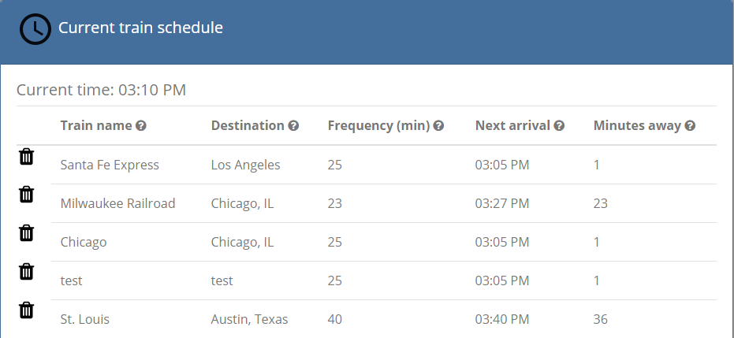
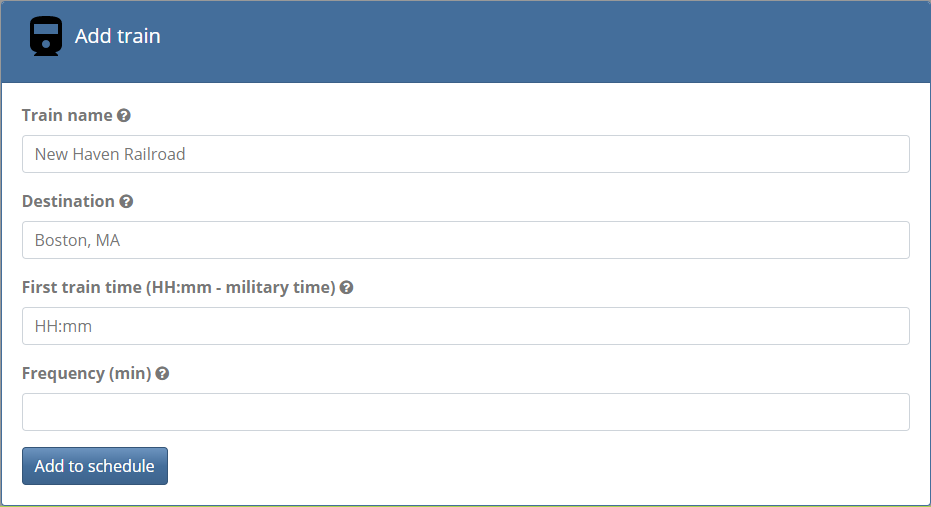
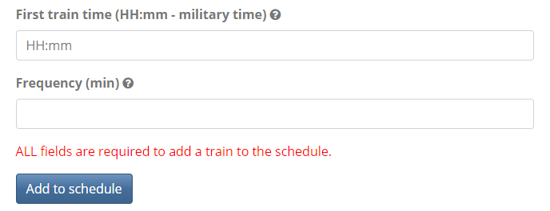
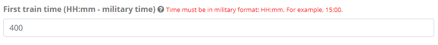
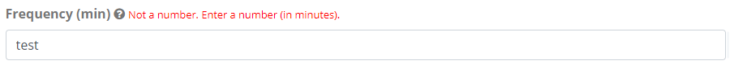
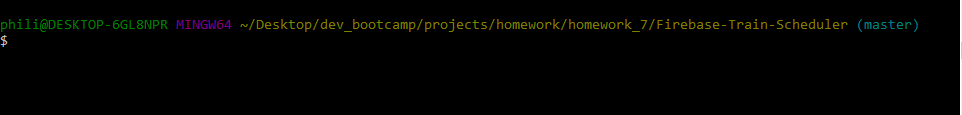
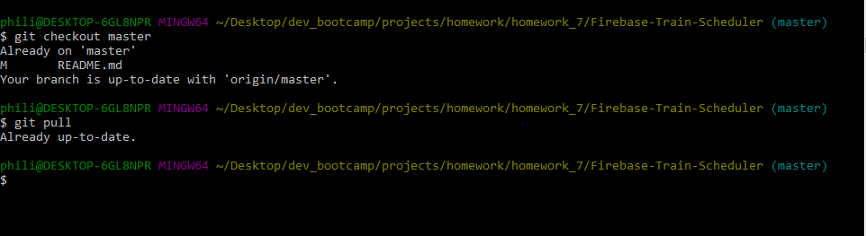

# myTrainBuilder
A train schedule application that incorporates Firebase to host arrival and departure data. 

## Table of contents
  * [About this project](#about-this-project)
  * [Live](#live)
  * [Structure of the project](#structure-of-project)
  * [Screenshots](#screenshots)
  * [Technologies used to create app](#technologies-used)
  * [How to use the Firebase API](#firebase-api)
  * [How to use the app](#how-to-use-app)
  	* [Entering or calculating train information](#train-info)
  	* [Adding a train to the schedule](#add-train)
  * [Form input validation](#form-validation)
  * [Future feature enhancements](#feature-enhancements)
  * [Known issues](#known-issues)
  * [Icons](#icons)
  * [Feedback](#feedback)
  * [How to contribute to this project](#contribute)

##  About this project

This project is a train schedule application that incorporates Firebase to host arrival and departure data. The app includes a form where users can enter information about a train, such as name, destination, first train time, and frequency. After a user submits the form, the app retrieves and manipulates this information with Moment.js to calculate the estimated next train time and number of minutes away. Moment.js is also used to display the times in a user friendly format (that is, hh:mm). When a user submits the information for a train, the train informaton is added to the Current schedule table to provide up-to-date information about various trains, such as their arrival times and how many minutes remain until they arrive at their stations. Not only is the train information added to the table, but the data is also pushed to a database that is hosted on Firebase. Source code will be developed over time to handle new features in the future.

##  Live

App is available live through Firebase:

https://fir-train-scheduler-7f4a9.firebaseapp.com/

##  Structure of the project
<ul>
<li> <b>/public/assets/images</b>: This directory contains the icons used in the app.</li>
<li> <b>/public/assets/javascript</b>: This directory contains the Javascript to:
	<ul>
		<li>Initialize the Firebase database.</li>
		<li>Display the time to the user.</li>
		<li>Grab the user input from the text boxes when a user submits the form.</li> 
		<li>Push the train data to the Firebase database when a train is added to the schedule.</li>
		<li>Perform Moment.js math calculations that determine values for train next arrival time and number of minutes away from destination.</li>
		<li>Update the HTML (<b>Current train schedule</b> table) to reflect the latest stored values in the Firebase database.</li>
	</ul>
</li>

<li><b>/public/assets/css</b>: This directory contains the external stylesheet used for the app.</li>
<li><b>/public/index.html</b>: This file contains the code for the HTML and Bootstrap markup.</li>
<li><b>firebase.json</b>: This file located in the root directory is the Firebase configuration file that gets created when you deploy a project to Firebase.</li>
<li><b>readme_images</b>: This directory contains images used in the README file.</li>
<li><b>database.rules.json</b>:This file contains the database rules that grant full read and write permissions to users.
</ul>

##  Screenshots

##  Technologies used to create app
<li>HTML5</li>
<li>CSS</li>
<li>Bootstrap 4.0.0-beta (http://getbootstrap.com/)</li>
<li>Javascript</li>
<li>JQuery (https://jquery.com/)</li>
<li>Firebase API for database hosting (https://firebase.google.com/)</li>
<li>Moment.js (http://momentjs.com/)</li>

##  How to use the Firebase API

To learn about the Firebase API and how to add Firebase to your web app, read the <a href="https://firebase.google.com/docs/web/setup" target="_blank">Firebase documentation</a>.

Because Firebase is a Google product, you will need to use your Google account to access and log into Firebase. If you don't have a Google account, you will need to create one.

##  How to use the app

###  Entering or calulating train information
To build the train schedule, you will need to provide information about the train, such as train name, destination, first train time, and frequency. This information is used to calculate the train next arrival time and number of minutes away using the Moment.js library. 

Train info | Description
------------ | -------------
Train name | The name of the train. For example, New Haven Railroad.
Destination | The location to where the train is traveling to. For example, Chicago, IL.
First train time (HH:mm - military time) | The first time that the train leaves (in military time).
Frequency (min) | How often (in minutes) the train leaves.
Next arrival | The next time the train will arrive at the destination. This value is calculated using the <b>Minutes away</b> value and is converted to a hh:mm time format using Moment.js.
Minutes away | The number of minutes until the next train is expected to arrive at the destination. This value is calculated using the <b>Frequency (min)</b> value the user enters in the form.

###  Adding a train to the schedule

To add a train to the schedule, use the <b>Add train</b> form to enter information about the train being added. All fields are required to add a train to the schedule.

<!-- ### Removing a train from the schedule

### Updating the train schedule -->

##  Form input validation

The app uses form input validation for the <b>Add train</b> form to check or validate the following:

	<li>The user has entered a value for every field (that is, all fields are required.). This ensures that there are no empty or null values when the form is submitted.
		If the user tries to add a train when there is an empty or null value, a red error message will appear that says "ALL fields are required to add a train to the schedule."
		
	</li>
	<li>The user has entered the First train time in military time (HH:mm). If the user doesn't enter the time in the correct format (for example, 9:00), red text will appear next to this field telling the user that the time needs to be in military time format.
	
	</li>
	<li>The user has entered a number for Frequency. If the user doesn't enter a number, red text will appear next to this field telling the user to enter a number.</li>
	

##  Future feature enhancements
<ul>
	<li>When user tries to remove a train from the schedule, an alert is displayed. Replace alert with modal.</li>
	<li>Make it so that only users who log into the site with their Google or GitHub accounts can use the site. Read up on Firebase authentication for this.</li>
	<li>Try adding update and remove buttons for each train. Let the user edit the row's elements -- allow them to change a train's name, destination, and arrival time (and then, by relation, minutes to arrival).</li>
	<li>Consider updating "minutes to arrival" and "next train time" text once every minute. This is significantly more challenging; only attempt this if completed the actual activity and committed it somewhere on GitHub for safekeeping (and maybe create a second GitHub repo).</li>
</ul>

##  Known issues

The following are known issues to be addressed in a future code update/when I have extra time.

<ul>
	<li>When deleting a train, the app currently only deletes the train from the web page. The train is not deleted from the database.</li>
	<li>The current time displayed at the top of the table is updating live. However, the next arrival and minutes away values in the table do not update live and only update on refresh of web page.</li>
</ul>

##  Icons
All icons used for this project can be obtained from <a href="http://fontawesome.io/icons/" target="_blank">Font Awesome</a> or <a href="https://www.iconfinder.com/" target="_blank">Iconfinder</a>.

##  Feedback

Feel free to send feedback via <a href="https://twitter.com/iamPhilStubbs" target="_blank">Twitter</a>, email (philipstubbs13@gmail.com), or <a href="https://github.com/philipstubbs13/Firebase-Train-Scheduler/issues/" target="_blank">file an issue</a>. Feature requests are always welcome.

##  How to contribute to this project.

Contributions to this project are greatly appreciated and will be recognized.

If you have an idea to implement, a feature to add, or an issue to fix, follow these steps:

<ol>
	<li>Send an email with your request to philipstubbs13@gmail.com to discuss.</li>
	<li>Run the following command to clone this repository to your local directory if it hasn’t been cloned already:
		<pre>git clone https://github.com/philipstubbs13/Firebase-Train-Scheduler.git</pre>
	</li>
	<li>Navigate to the folder where you cloned the repository.
		
	</li>
	<li>Run the following commands to ensure that you have the latest and greatest code.</li>
		<pre>git checkout master</pre>
		<pre>git pull</pre>
		
	</li>
	<li>Run the following command to create and checkout a branch for where you will make your code updates:</li>
		<pre>git checkout -b branch_name </pre>
	<li>Make your changes, commit the code, and then push/upload the changes to only your branch.</li>
		<pre>git add .</pre>
		<pre>git commit -m "my code changes"</pre>
		<pre>git push origin name_of_branch</pre>
	<li>Navigate to the repository on GitHub and submit a pull request for review and approval to add your changes to code base.</li>
</ol>

